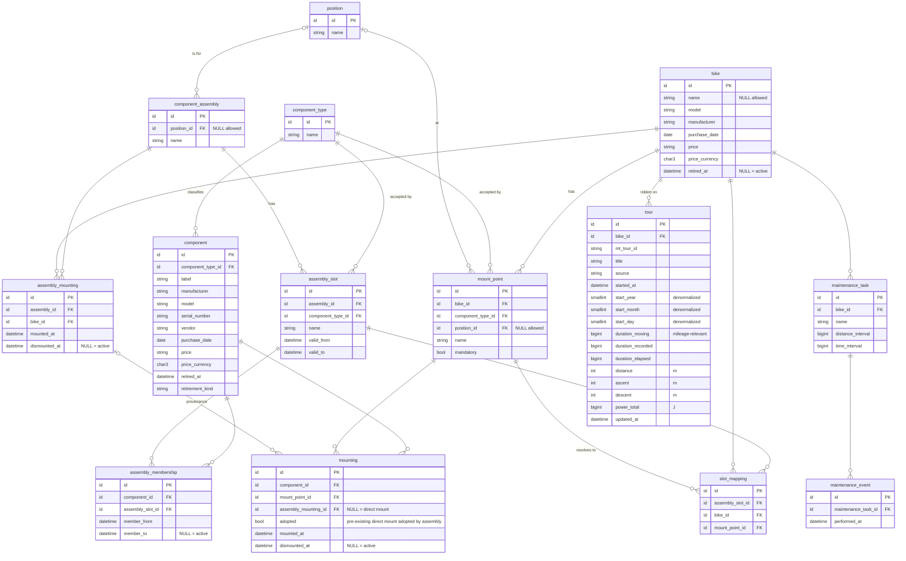

# CETracker Database Model

## Modeling language & visualisation

**Notation:** relational model in **crow's-foot ER notation** — the de-facto standard for relational schemas and directly expressible as Mermaid `erDiagram` **Engine: PostgreSQL 17** (partial unique indexes and exclusion constraints enforce the temporal invariants declaratively; see integrity rules below).

## ER diagram

