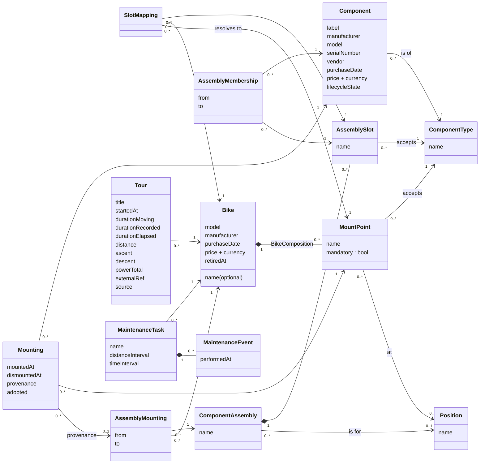

# CETRacker Domain Model

## Visualisation

Type-compatibility rule (not expressible in the diagram): `Mounting.component.componentType == Mounting.mountPoint.acceptsType`, and likewise for AssemblyMembership/AssemblySlot.
